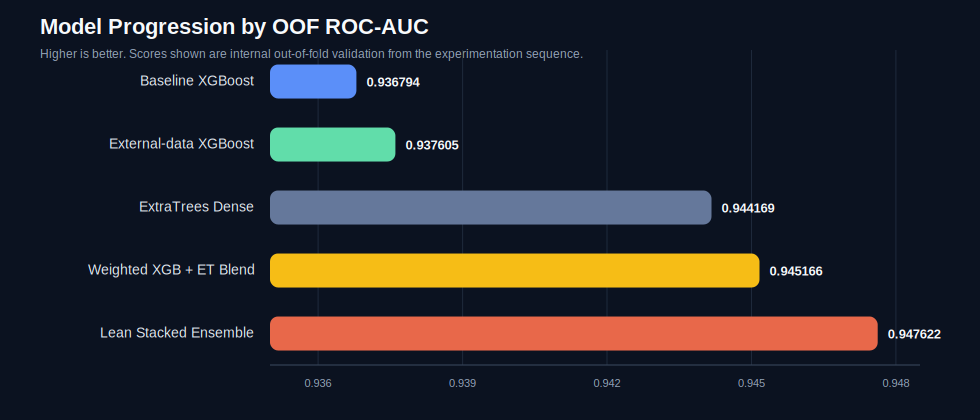
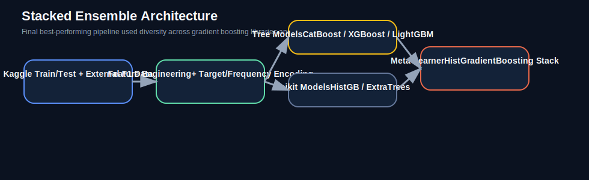

# F1 Pit Stop Kaggle Challenge

A reproducible machine learning pipeline for the Kaggle playground challenge on **predicting whether a Formula 1 driver will pit on the next lap**.

[Competition](https://www.kaggle.com/competitions/playground-series-s6e5) • [Original F1 Strategy Dataset](https://www.kaggle.com/datasets/aadigupta1601/f1-strategy-dataset-pit-stop-prediction/data)

## Overview

This project started as a strong tabular baseline and evolved into a multi-stage ensemble workflow:

- race-aware feature engineering from lap, stint, tyre, degradation, and position context
- leakage-safe target encoding and frequency encoding
- external supervision from the original F1 strategy dataset
- dense-model experimentation with `ExtraTrees`
- final lean stacked ensemble using `CatBoost`, `XGBoost`, `LightGBM`, `HistGradientBoosting`, and `ExtraTrees`

The final stack produced the strongest internal validation score in this project:

- **Best OOF ROC-AUC:** `0.947622`

## Results

### Experiment Progression

| Iteration | Main change | OOF ROC-AUC |
| --- | --- | ---: |
| V1 | Race-aware XGBoost ensemble | `0.936794` |
| V2 | Added external F1 strategy dataset | `0.937605` |
| V3 | Dense-feature ExtraTrees model | `0.944169` |
| V3.1 | Weighted XGBoost + ExtraTrees blend | `0.945166` |
| V4 | Lean stacked ensemble | `0.947622` |



### Final Stack Components

| Model | OOF ROC-AUC |
| --- | ---: |
| CatBoost | `0.944062` |
| XGBoost | `0.944922` |
| LightGBM | `0.944721` |
| HistGradientBoosting | `0.939793` |
| ExtraTrees | `0.944448` |
| Vote of boosted-tree family | `0.944581` |
| **Stacked meta-model** | **`0.947622`** |



## Repository Structure

```text
.
├── assets/
│   ├── oof_auc_progress.svg
│   └── stack_architecture.svg
├── blend_predictions.py
├── train_dense_models.py
├── train_solution.py
├── train_stacking_models.py
├── requirements.txt
└── README.md
```

## Approach

### 1. Feature engineering

Core engineered features include:

- `RaceYear`, `DriverCompound`, `DriverRace`, `CompoundStint`
- estimated total laps from `LapNumber / RaceProgress`
- `LapsRemaining`
- tyre wear ratios and interaction terms
- degradation-per-lap and lap delta rates
- position-normalized and stint-pressure features

### 2. Encoding strategy

For high-cardinality categories, the training scripts use fold-safe:

- target encoding
- frequency encoding

This keeps leaderboard leakage under control while preserving strong driver/race signal.

### 3. Model progression

The project intentionally moved through increasingly diverse model families:

1. native-categorical and gradient-boosted trees
2. external-data augmentation
3. dense tabular ensembles
4. final stacking over complementary base learners

## Setup

### Install dependencies

```bash
python3 -m pip install -r requirements.txt
```

### Download competition data

Place the Kaggle files locally:

- `train.csv`
- `test.csv`
- `sample_submission.csv`

Optional external training data:

- `f1_strategy_dataset_v4.csv`

If you use the Kaggle CLI:

```bash
kaggle competitions download -c playground-series-s6e5
kaggle datasets download aadigupta1601/f1-strategy-dataset-pit-stop-prediction --unzip
```

## Training

### Baseline and external-data XGBoost pipeline

```bash
python3 train_solution.py \
  --train-path /path/to/train.csv \
  --test-path /path/to/test.csv \
  --sample-submission-path /path/to/sample_submission.csv \
  --output-dir outputs_baseline
```

With external supervision:

```bash
python3 train_solution.py \
  --train-path /path/to/train.csv \
  --test-path /path/to/test.csv \
  --external-train-path /path/to/f1_strategy_dataset_v4.csv \
  --external-weight 0.35 \
  --sample-submission-path /path/to/sample_submission.csv \
  --output-dir outputs_external
```

### Dense-model experiments

```bash
python3 train_dense_models.py \
  --train-path /path/to/train.csv \
  --test-path /path/to/test.csv \
  --external-train-path /path/to/f1_strategy_dataset_v4.csv \
  --external-frac 0.35 \
  --sample-submission-path /path/to/sample_submission.csv \
  --models et,mlp \
  --output-dir outputs_dense
```

### Final stacking pipeline

```bash
python3 train_stacking_models.py \
  --train-path /path/to/train.csv \
  --test-path /path/to/test.csv \
  --external-train-path /path/to/f1_strategy_dataset_v4.csv \
  --external-frac 0.35 \
  --sample-submission-path /path/to/sample_submission.csv \
  --folds 5 \
  --base-models catboost,xgboost,histgb,lightgbm,et \
  --meta-model histgb \
  --output-dir outputs_stack_final_lean
```

### Prediction blending utility

```bash
python3 blend_predictions.py \
  --oof-a /path/to/oof_model_a.csv \
  --oof-b /path/to/oof_model_b.csv \
  --sub-a /path/to/submission_a.csv \
  --sub-b /path/to/submission_b.csv \
  --weight-a 0.25 \
  --weight-b 0.75 \
  --output-path /path/to/final_submission.csv
```

## Notes

- Competition data and generated outputs are intentionally excluded from version control.
- Public leaderboard scores can move independently of local OOF, so all major changes were validated through out-of-fold comparisons first.
- The final stack outperformed direct blending of the earlier `XGBoost + ExtraTrees` submission candidates.
